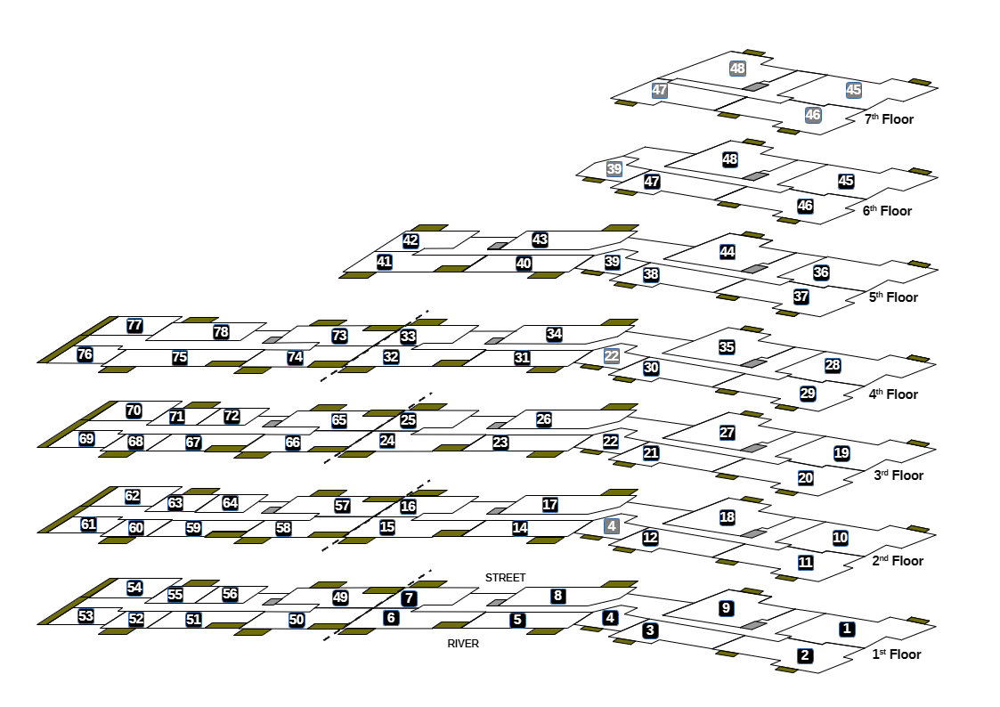

# Riverside House – floor layout

Not a legal plan: the plans attached to each lease define the extent of each flat.

## Orientation

The block runs west to east. Its street side faces roughly north and its river side
roughly south.

The ground floor has no flats: it holds the stairwells, the car park, the bike store and
the pump room. The flats are on the 1st to 7th floors.

## Division of the block

On floors 1–4 each floor is divided into a west half (flats 49–78) and an east half
(flats 1–48), with no through access between them:

| Floor | West half | East half |
|---|---|---|
| 1st | 49–56 | 1–9 |
| 2nd | 57–64 | 10–18 |
| 3rd | 65–72 | 19–27 |
| 4th | 73–78 | 28–35 |

Floors 5–7 are entirely in the east half.

## Two-storey flats

| Flat | Main floor | Upper floor |
|---|---|---|
| 4 | 1st | 2nd |
| 22 | 3rd | 4th |
| 39 | 5th | 6th |
| 45, 46, 47, 48 | 6th | 7th |

## Flats on each floor

For the list of flats on each floor, see
[Riverside House – background](/building/riverside-house.md).

## Diagram

An isometric view of the 1st to 7th floors, illustrative only and not to scale. It looks
north-northeast, so the left of the diagram is west and the right is east; the street
and river sides are labelled on the 1st floor.

| Mark | Meaning |
|---|---|
| Number in a black box | Flat number, shown on the flat's main floor |
| Number in a grey box | Upper floor of a two-storey flat |
| Olive bar | Balcony |
| Small grey square | Lift |
| Dashed line | No through access between the east and west halves of the block |
